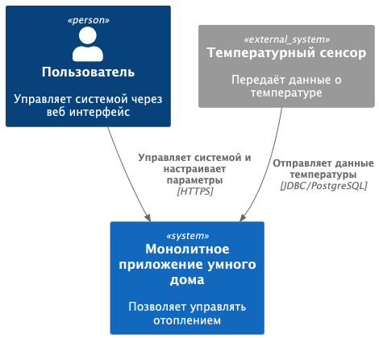
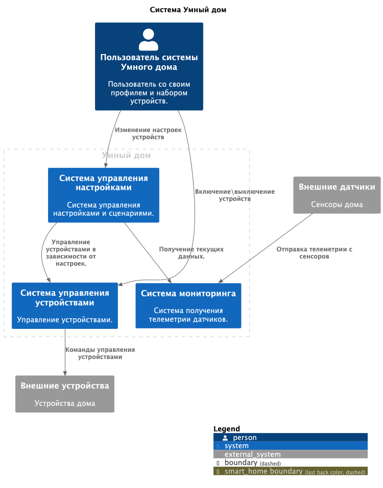
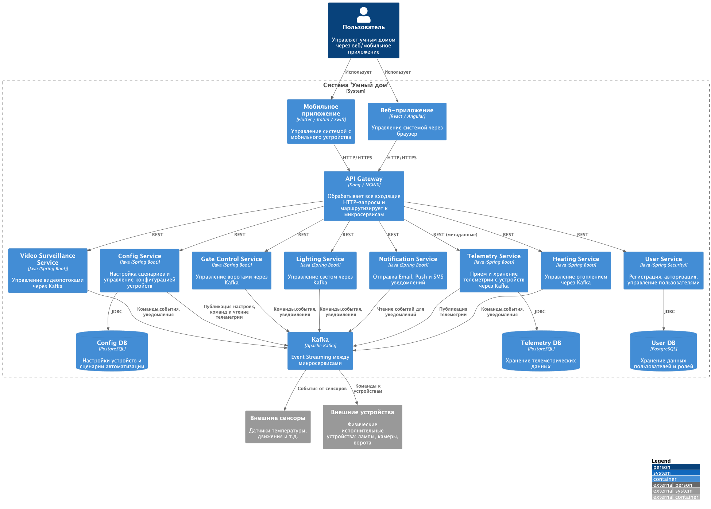
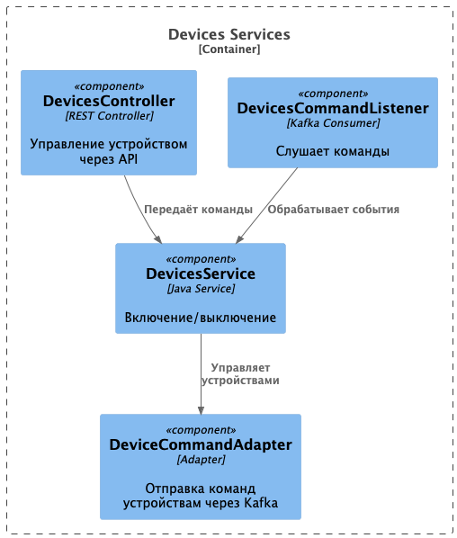
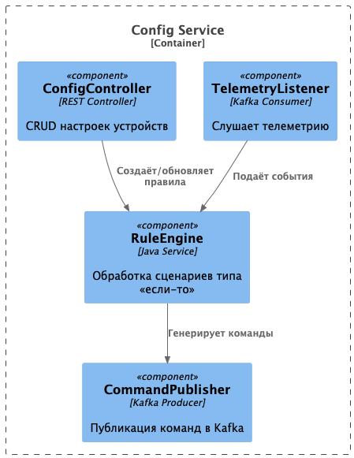
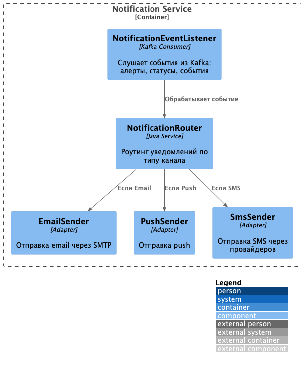
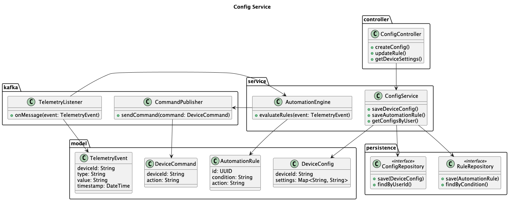
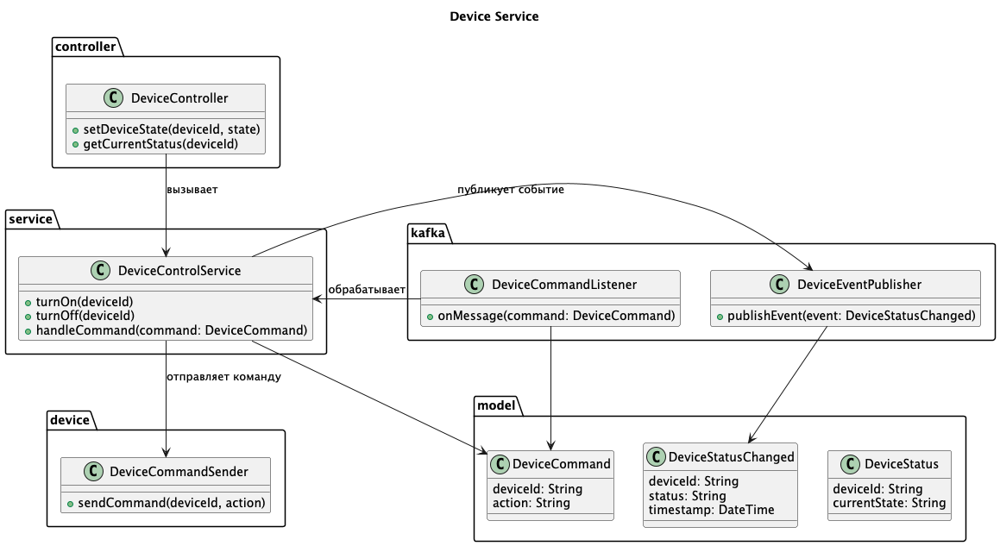
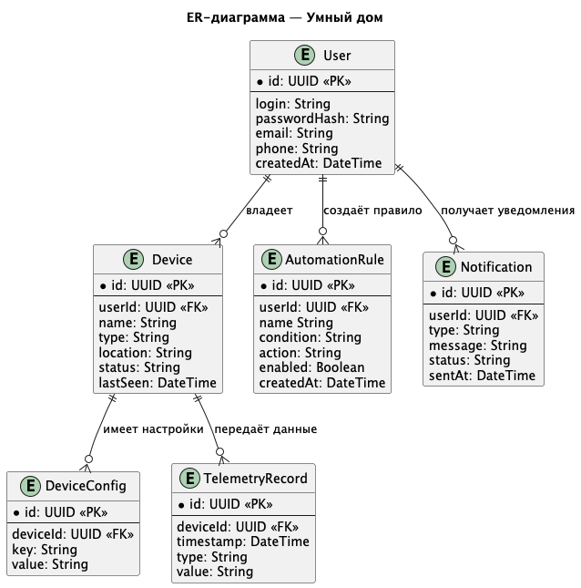

# Project_template

Это шаблон для решения проектной работы. Структура этого файла повторяет структуру заданий. Заполняйте его по мере работы над решением.

# Задание 1. Анализ и планирование

<aside>
💡

Чтобы составить документ с описанием текущей архитектуры приложения, можно часть информации взять из описания компани и условия задания. Это нормально.

</aside>

### 1. Описание функциональности монолитного приложения

**Управление отоплением:**

- Пользователи могут включать и выключать отопление
- Пользователи могут получить информацию о текущем состоянии системы
- Система поддерживает изменение системы

**Мониторинг температуры:**

- Пользователи могут получить текущую температуру 
- Пользователи могут задать целевую температуру
- …

### 2. Анализ архитектуры монолитного приложения

Текущая архитектура: монолит. Сервис реализован на java с использованием springframework. 
Сервис использует одну БД — Postgres. Система не дает взаимодействия между сенсорами температуры и системой отопления.

### 3. Определение доменов и границы контекстов

В текущей реализации можно выделить основные три домена системы:
 1. Управление отоплением
    Управление состоянием отопления (включение/выключение/задание целевой температуры)
 2. Телеметрия температуры
    Хранение температурных показателей от сенсоров
 3. Пользовательские настройки
    Хранение настроек системы для пользователя

### **4. Проблемы монолитного решения**

- Невозможно масштабировать отдельные модули
- Нет чётко выделенных контекстов или слоёв
- Все операции требуют синхронного выполнения
- Нет возможности горизонтального масштабирования

### 5. Визуализация контекста системы — диаграмма С4
1. Текущая монолитная диаграмма

2. Целевая контекстная диаграмма

# Задание 2. Проектирование микросервисной архитектуры

В этом задании вам нужно предоставить только диаграммы в модели C4. Мы не просим вас отдельно описывать получившиеся микросервисы и то, как вы определили взаимодействия между компонентами To-Be системы. Если вы правильно подготовите диаграммы C4, они и так это покажут.

**Диаграмма контейнеров (Containers)**

**Диаграмма компонентов (Components)**

1. Управление устройствами

2. Управление настройками

3. Сервис нотификаций

**Диаграмма кода (Code)**

1. Управление настройками

2. Управление устройствами

# Задание 3. Разработка ER-диаграммы

# ✅ Задание 4. Создание и документирование API

### 1. Тип API

Для взаимодействия будет использоваться AsyncAPI. Это позволит обрабатывать асинхронно запросы и даст возможность масштабирования

### 2. Документация API

[AsyncAPI спецификация](./docs/asyncapi.yaml)
